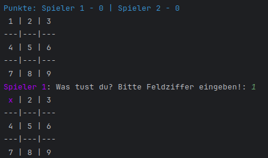
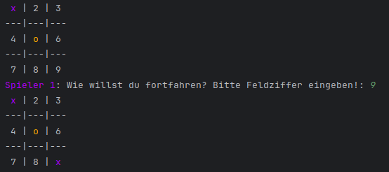
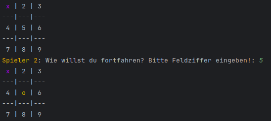
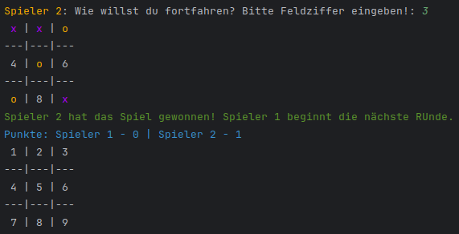
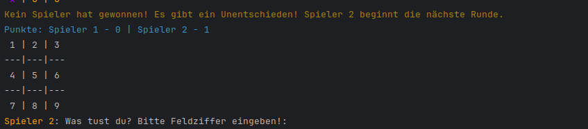

# Tic-Tac-Toe Console Game

This is a simple Tic-Tac-Toe game implemented in Python, designed for two players to play against each other in the console. The game features colored symbols for each player and keeps track of the scores throughout multiple rounds. Each round concludes with a message announcing the winner, or indicating a tie, and the game continues with the next round.

## Features

- Two-player game with alternating turns.
- Colored symbols (`X` for Player 1 and `O` for Player 2).
- Real-time score tracking.
- Displays messages for winning, losing, or a draw at the end of each round.
- Minimalistic console design with user prompts for each move.
- Multi-language support: Choose your preferred language at the start of the game.

## Supported Languages

The game currently supports the following languages:

- **Deutsch** (German)
- **English** (English)
- **Français** (French)
- **العربية** (Arabic)
- **日本語** (Japanese)
- **Polski** (Polish)
- **Türkçe** (Turkish)
- **Norsk** (NORWEGIAN)

Players can choose the language at the start of the game.

## How to Play

1. Clone the repository to your local machine:
    ```bash
    git clone https://github.com/your-username/tic_tac_toe_console.git
    cd tic_tac_toe_console
    ```

2. Run the game:
    ```bash
    python tic_tac_toe.py
    ```

3. At the start, you will be prompted to choose the language for the game.

4. The game will prompt each player to input the number of the field where they want to place their symbol. The fields are numbered as follows:
  ```
   1 | 2 | 3
  ---|---|---
   4 | 5 | 6
  ---|---|---
   7 | 8 | 9
  ```

5. Players will alternate turns by entering the number corresponding to their desired position on the board. The game will automatically update and display the current board, including score tracking.

6. The first player to get three of their symbols in a row (horizontally, vertically, or diagonally) wins the round, and the score will be updated.

7. The game continues until players decide to exit.

## Screenshots

### Start of the Game



### Player 1's Turn



### Player 2's Turn



### Player 2 Wins



### A Draw



## Requirements

- Python 3.x

## License

This project is licensed under the MIT License.